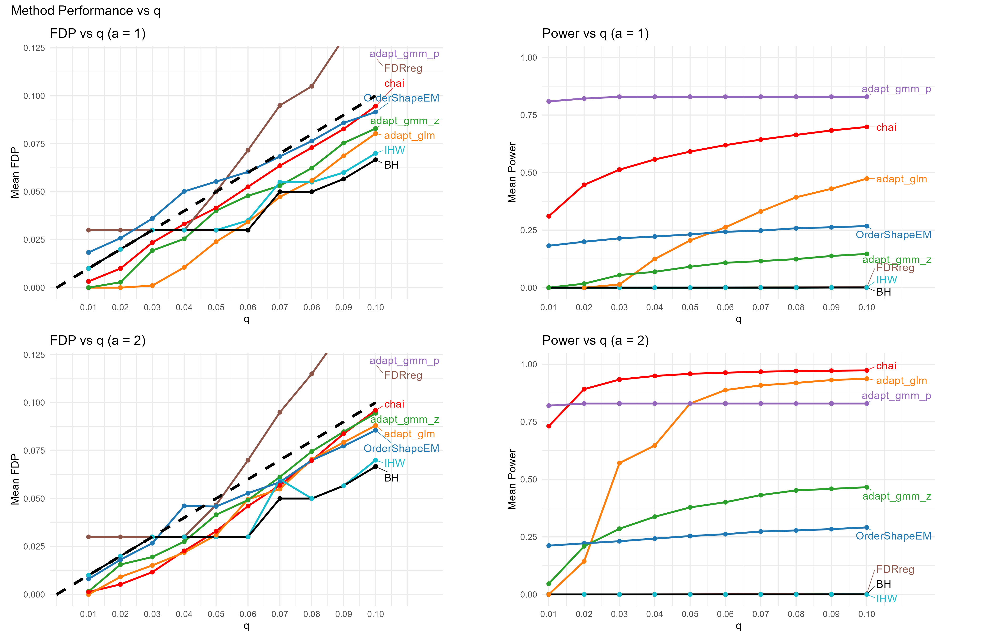
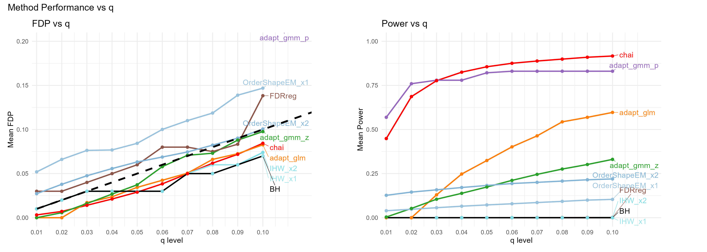
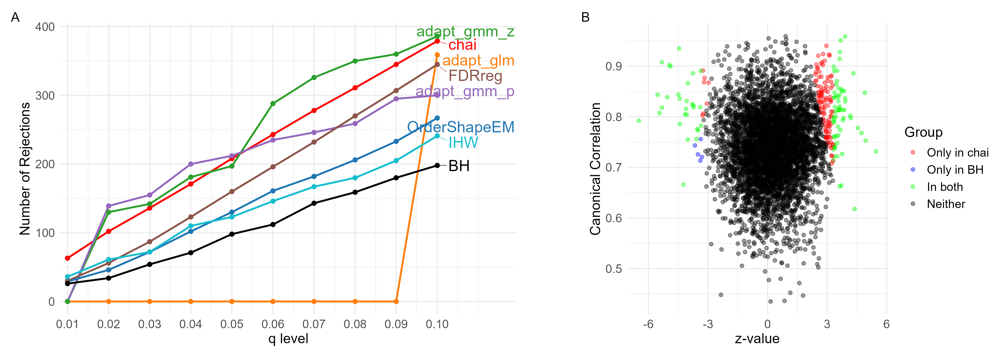
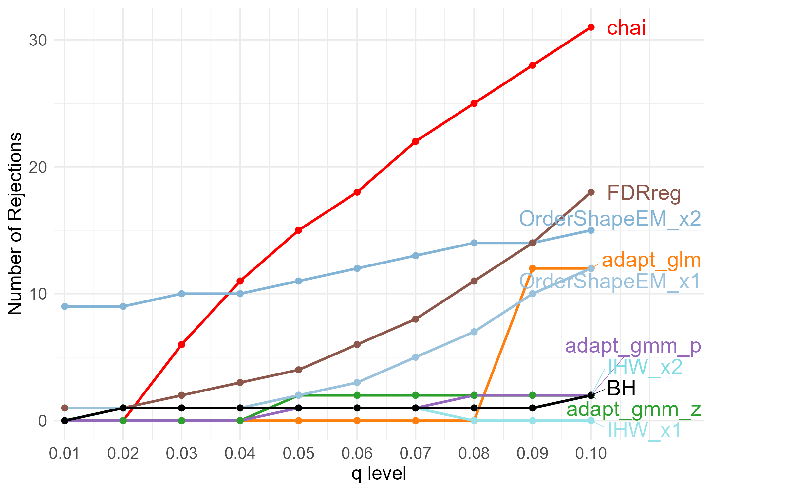
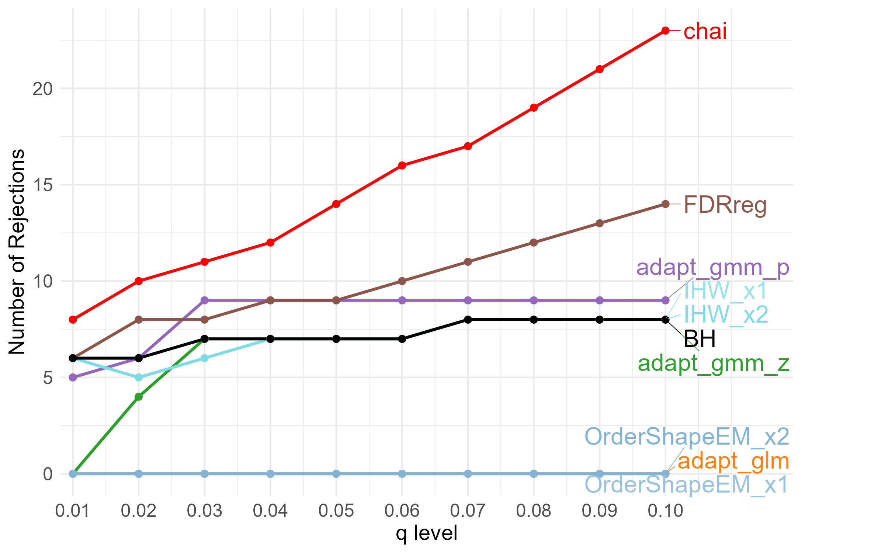
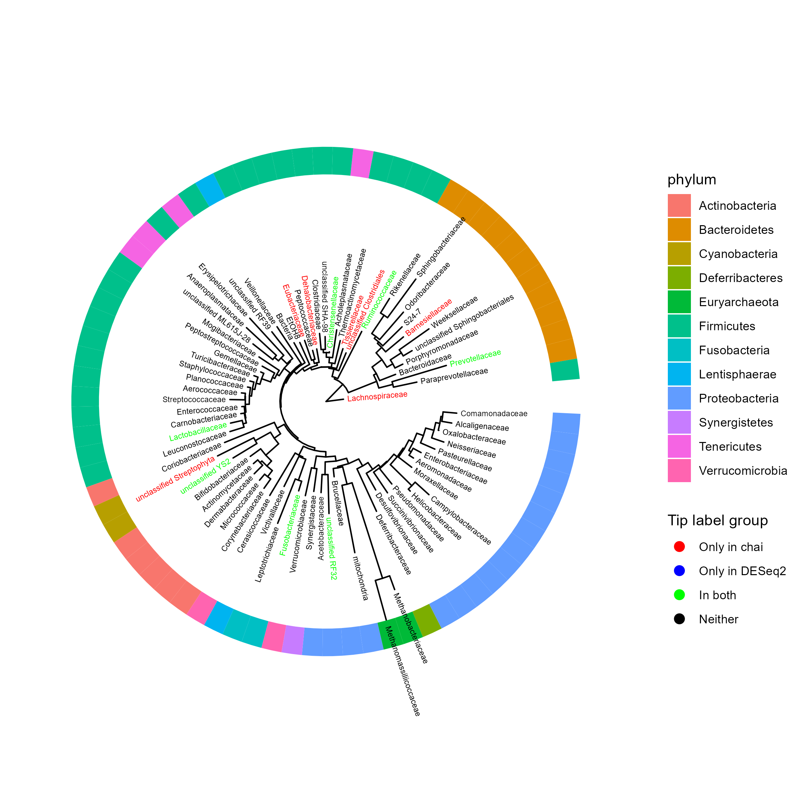
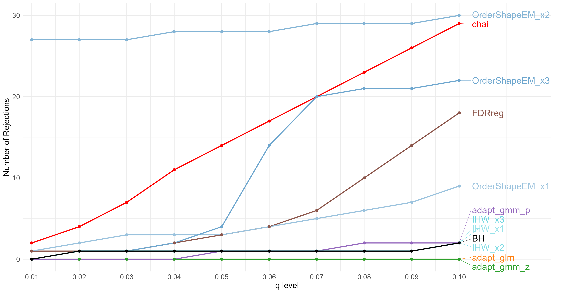

# chai Project Repository
**chai** - Conditional Hypothesis testing using Auxiliary Information

**chai** is a covariate-informed statistical framework. It leverages auxiliary information to enhance the statistical power of multiple hypothesis testing while controlling the false discovery rate (FDR) of high-dimensional data (such as 16S rRNA and WGS microbiome sequencing).

This repository contains all files related to the **chai** project.  
Please note that this repository does NOT include the `chai` R package itself.  
To install the `chai` package, please visit: **[chai](https://github.com/ziyiwang726/chai)**.

## Authors

**Ziyi Wang, Satabdi Saha, Christine B. Peterson, Yushu Shi**

## Repository Structure

- `data/`:
  Contains the real data used in the project.

- `scripts/`: 
  Contains all related R scripts and Python scripts.

- `reports/`:
  Contains the full workflow from data processing to visualization, including both code and generated figures.

- `figures/`:
  Contains all related figures.

## Simulation 1 - One dimensional auxiliary-information
For the generation and visualization of **Simulation 1**, please see: [Simulation 1](https://ziyiwang726.github.io/chai_project/reports/JASA_Simulation_1.html).  

#### Simulation setting
Briefly, this simulation considers a multiple testing setting with 1,000 hypotheses, including 950 null hypotheses and two non-null groups with positive and negative signals. 

For each simulation run, $z$-statistics are generated from a three-component mixture: the null group follows $N(0,1)$, while the two alternative groups follow normal distributions centered at $2$ and $-2$ with variance 0.5. Two-sided $p$-values are then computed from the simulated $z$-statistics.

In Parallel, a side-information variable $\mathbf{X}$ is generated fro each hypothesis. The informativeness of $\mathbf{X}$ is controlled by a parameter $a$, where $a = 0$ means $\mathbf{X}$ is uninformative about signal status, and larger values of $a$ make the separation of $\mathbf{X}$ between null and non-null groups stronger. We considered $a \in {0, 0.5, 1, 1.5, 2}$, ranging from no information to highly informative side information. The simulation was repeated 100 times using different random seeds, and results were evaluated across a grid of target FDR levels from 0.01 to 0.10.

#### Results

Here is the line chart of **chai** and other benchmark methods in simulation 1 when informativeness parameter $a$ is fixed at 1 or 2:

## Simulation 2 - Two dimensional auxiliary-information
For the generation and visualization of **Simulation 2**, please see: [Simulation 2](https://ziyiwang726.github.io/chai_project/reports/JASA_Simulation_2.html).  

#### Simulation setting
This simulation also considers a multiple testing setting with 1,000 hypotheses, including 950 null hypotheses and two non-null groups with positive (25) and negative signals (25). 

The null hypotheses were generated from standard normal distributions, while the two alternative groups were generated with positive and negative signals in both the test statistic and side infromation. Specifically, the side information included two variables, $x1$ and $x2$, which were combined into a two-dimensional covariate matrix $\mathbf{X}$. The simulation was repeated 100 times with different random seeds.

#### Results

This line chart shows the number of rejected hypotheses selected by **chai** and other benchmark methods in simulation 2 across different target FDR levels:

## Real data

### 1. Shotgun metagenomic sequencing data: gastrectomy vs. healthy individuals
For the full application and visualization of this real dataset, please see: [Gastrectomy](https://ziyiwang726.github.io/chai_project/reports/JASA_Realdata_Gastrectomy.html).

#### Results
Plot A below is the line chart that shows the number of genera selected by **chai** and other benchmark methods at different target FDR level ($q$) in this post-gastrectomy dataset. Plot B is the scatter plot of the Canonical correlation coefficient vs. z-statistics, colored by whether it selected by **chai** and/or **BH**. 

### 2. 16S rRNA gene sequence data: responders vs. non-responders in a melanoma cohort
For the full application and visualization of this real dataset, please see: [Melanoma with PCoA](https://ziyiwang726.github.io/chai_project/reports/JASA_Realdata_Melanoma_PCoA.html) and [Melanoma with LLM](https://ziyiwang726.github.io/chai_project/reports/JASA_Realdata_Melanoma_LLM.html)

We tried three different analysis configurations:

- `(i)`: Wilcoxon z-statistics with phylogeny-derived PCoA covariates as X,
- `(ii)`: DESeq2-derived signed Wald statistics with PCoA covariates as X,
- `(iii)`: Wilcoxon z-statistics with the LLM-derived 3 covariates as X.

#### Results
- `(i)`: Wilcoxon z-statistics with phylogeny-derived PCoA covariates as X

- `(ii)`: DESeq2-derived signed Wald statistics with PCoA covariates as X

- `(iii)`: Wilcoxon z-statistics with the LLM-derived 3 covariates as X

### 3. Shotgun metagenomic sequencing data: schizophrenia vs. healthy individuals
For the full application and visualization of this real dataset, please see: [Schizophrenia](https://ziyiwang726.github.io/chai_project/reports/JASA_Realdata_Schizophrenia.html).
